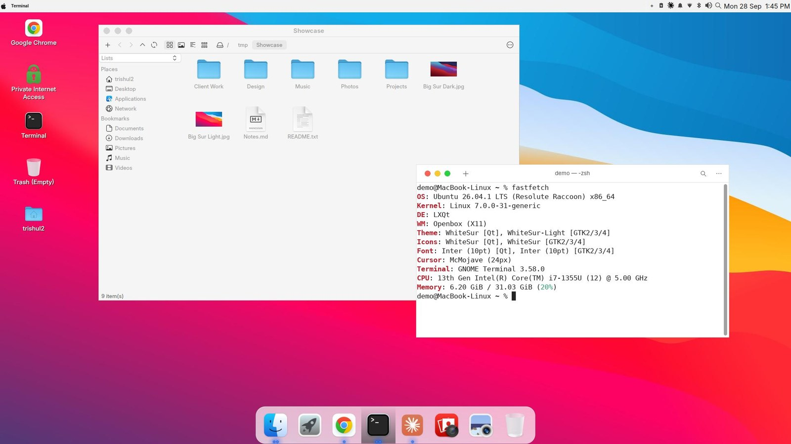
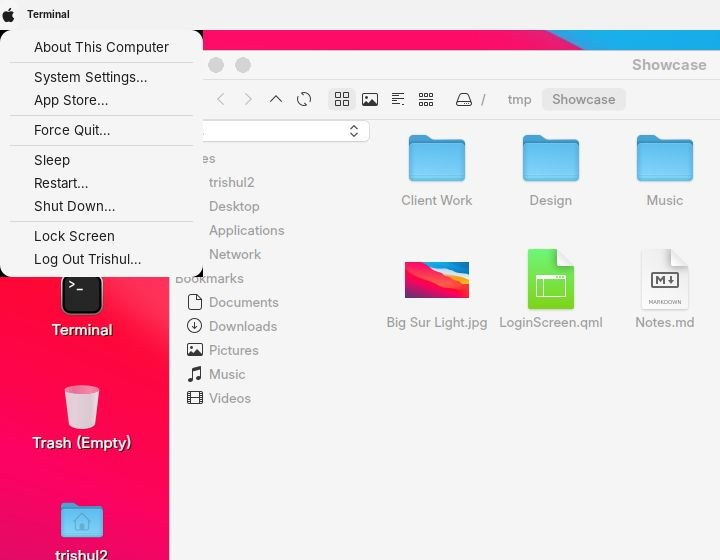
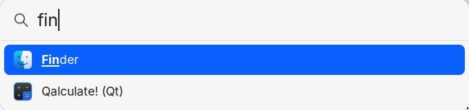
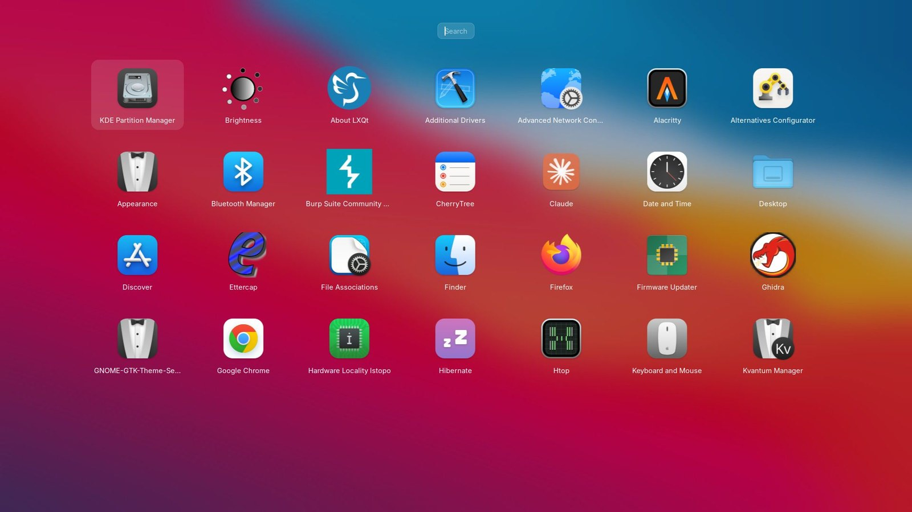
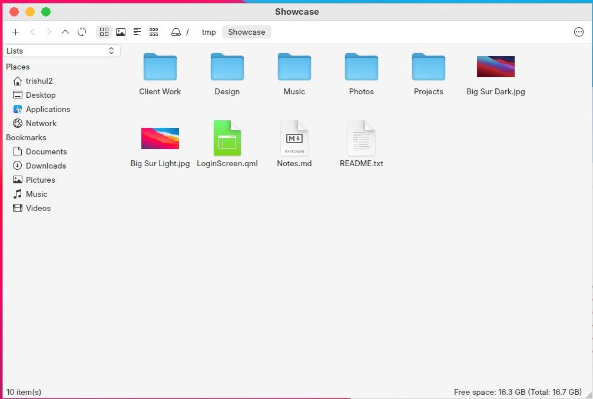
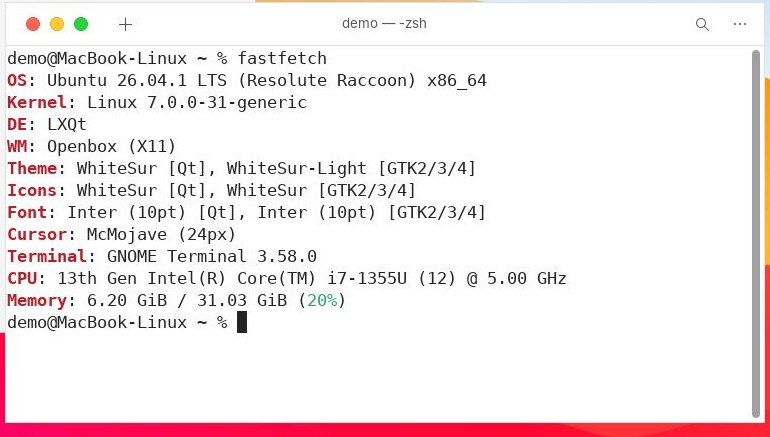
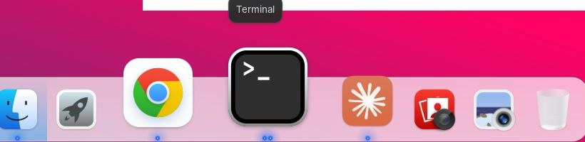
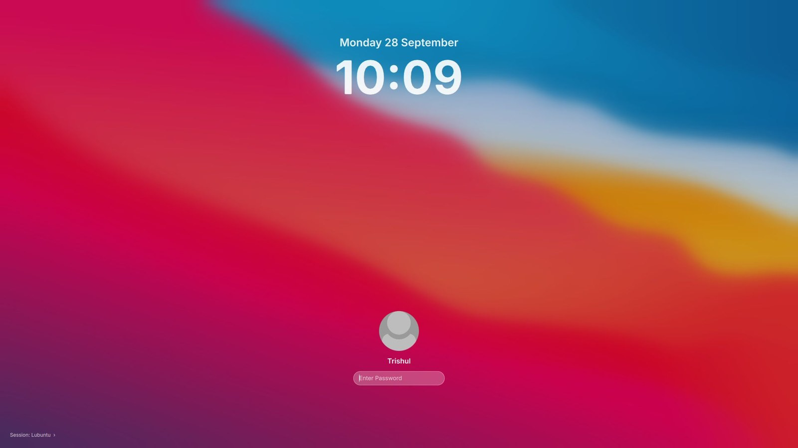

# Linux, dressed as macOS

A free Lubuntu laptop that looks and feels a lot like my MacBook: menu bar, Dock, Launchpad, Spotlight,
Finder, traffic-light buttons and a macOS-style login screen.

I didn't edit a single config file myself. I described what I wanted to an AI coding agent
([Claude Code](https://claude.com/claude-code)), one request at a time, and it did the work, starting with
a full backup and a one-command undo.



| Menu bar | Spotlight |
|---|---|
|  |  |
| **Launchpad** | **Finder** |
|  |  |
| **Terminal** | **Dock** |
|  |  |



## Try it

> **Back up and try it in a virtual machine first.** This was built on one machine and has not been
> tested anywhere else. Both installers back up everything they change and print a `restore.sh` that undoes it.

### Lubuntu 26.04 (the full version, as in the screenshots)

```bash
git clone https://github.com/rajiv2312/linux-macos-look.git
cd linux-macos-look/lubuntu
./install.sh
```

Log out and back in when it's done.

| macOS | Here |
|---|---|
| Launchpad | `F4`, or the rocket in the Dock |
| Spotlight | `Super + Space`, or the magnifier in the menu bar |
| Apple menu | the Apple logo (Sleep, Restart, Shut Down, Log Out, ...) |
| Finder | the file manager (PCManFM-Qt) |

**Undo:** `~/macos-look-backup/<date>/restore.sh`, then log out and back in.

### Ubuntu 26.04 with GNOME (experimental)

```bash
cd linux-macos-look/gnome
./install.sh
```

GNOME works differently from LXQt, so this version gets the same look using GNOME's own parts:
WhiteSur GTK + Shell theme, Ubuntu Dock moved to the bottom, traffic lights on the left, Big Sur wallpaper.
Launchpad is GNOME's app grid and Spotlight is GNOME search (press `Super`).
**Untested so far.** Please open an issue if something breaks.

## What the Lubuntu installer changes

- **Themes:** WhiteSur GTK (light + dark), WhiteSur icons, WhiteSur Kvantum for Qt apps (made opaque, bigger tabs),
  McMojave cursors, Inter font. Downloaded from GitHub at pinned versions.
- **Menu bar:** LXQt panel + vala-panel global menu with an Apple menu; light bar, Papirus-Light tray icons, Spotlight icon, Mac-style clock.
- **Dock:** Plank with magnification, running dots and Trash; Finder, Launchpad, Terminal and Preview pinned.
- **Launchpad & Spotlight:** rofi, themed as a full-screen app grid and a centred search bar.
- **Windows:** Openbox themes with red/yellow/green buttons on the left; drag a maximised window's title bar to pull it out.
- **Apps renamed like macOS:** Finder, Terminal (GNOME Terminal), Preview, TextEdit.
- **Login screen:** a small SDDM theme with blurred wallpaper, big clock, round avatar and pill password field.
- **Extras:** light notification cards (top right), Flurry screensaver, macOS-style password prompt, subtle window animations (picom).

Everything under `lubuntu/files/` is copied into your home folder (`@HOME@` / `@REALNAME@` are filled in for you).

## Credits

- [WhiteSur GTK](https://github.com/vinceliuice/WhiteSur-gtk-theme), [WhiteSur icons](https://github.com/vinceliuice/WhiteSur-icon-theme),
  [WhiteSur KDE/Kvantum + wallpapers](https://github.com/vinceliuice/WhiteSur-kde) and
  [McMojave cursors](https://github.com/vinceliuice/McMojave-cursors) by vinceliuice. They are downloaded by the installer, not included here.
- [Plank](https://launchpad.net/plank), [rofi](https://github.com/davatorium/rofi), [vala-panel-appmenu](https://gitlab.com/vala-panel-project/vala-panel-appmenu),
  [Inter](https://rsms.me/inter/), [Papirus](https://github.com/PapirusDevelopmentTeam/papirus-icon-theme), LXQt, Openbox, picom.
- Built with [Claude Code](https://claude.com/claude-code).

Not affiliated with or endorsed by Apple. macOS, Finder, Launchpad and Spotlight are trademarks of Apple Inc.,
used here only to describe the look.

## License

The scripts and configs in this repository are MIT licensed (see `LICENSE`), except:
- `lubuntu/files/home/.local/share/lxqt/themes/kvantum-macos/` is a modified copy of LXQt's *kvantum* panel theme (LGPL-2.1+).
- `lubuntu/files/home/.local/share/plank/themes/WhiteSur-Dark/dock.theme` is based on WhiteSur's Plank theme (MIT).

Downloaded third-party themes keep their own licenses.
